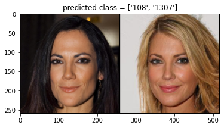
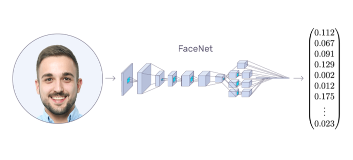
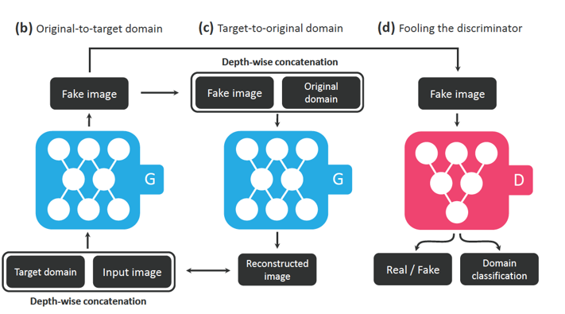
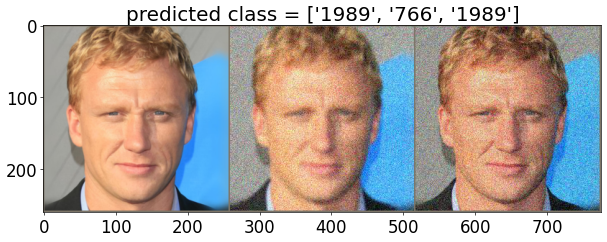
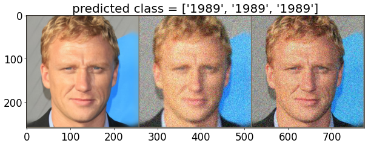
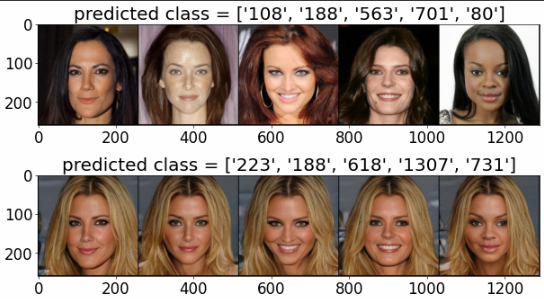
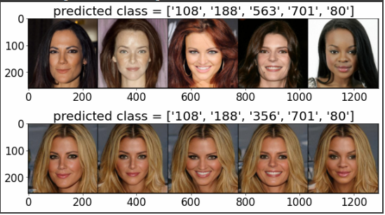

<h1 align="center">Defend against adversarial attacks in face recognition models</h1>
<h2 align="center">
   
Final project  
Technion's EE  
Deep Learning course (046211)
   
  
</h1>
  

    Gil Kapel: <a href="https://www.linkedin.com/in/gil-kapel-a960b720a/">LinkdIn</a> , <a href="https://github.com/gil-kapel">GitHub</a>
   
    Shelly Francis: <a href="https://www.linkedin.com/in/shelly-francis-85bb2b217/">LinkdIn</a> , <a href="https://github.com/shellyfra">GitHub</a>
  

## Agenda
- [Face Recognition Attacks](#Face-Recognition-Attacks) - About our project
- [Training and Results](#training-and-results) - our network's training visualizations and results
- [Run our model](#run-our-model) - how to load our model and test on different images from celebA-hq subset
- [Hyper-parameters](#hyper-parameters) - what are our training's hyperparameters

# Face-Recognition-Attacks
Face recognition is a domain with many uses in real-world applications – ranging from photo tagging to automated border control (ABC).
Today’s models have high accuracy
These models could be vulnerable to adversarial attacks
An attacker can intentionally design features that would confuse the network and even impersonate to someone else.
We tested some counter measures against these attacks on face-net model

### FaceNet:
FaceNet is a deep neural network model used for extracting features 
from an image of a person’s face that was proposed by Google in 2015. 
The model takes an image of the person’s face as input and outputs an
embedding vector which represent the most important features of a face.

We trained our model to fit a subset of CelebA-HQ dataset, that uses 300 identities.
If you want to add your on images, it's possible by fine-tune (train for short time)
Our model.

### Star-Gan-v2

Star GAN is a model that transfers an image that has 
attributes list A to an image with attribute list B.

The way to use this model is to give it reference and source images (In directories as mentioned below)
and then the GAN would generate the source img with some of the reference image attributes
(hair-style, sun-glasses, beard, face accessories etc.)

### Dataset
Our dataset is celebA-HQ subset : <a href="https://mmlab.ie.cuhk.edu.hk/projects/CelebA.html">CelebA dataset </a>,

### Our adversarial attack:

We created to kind of attacks:
#### 1.
Attack by adding augmentation to the tested image - gaussian noise, color jitter etc.
This attack could be a software attack where the images are augmented automatically before tested in the FR system
We so that the FaceNet can be fool by this kind of attack, but we can defend it in some manners.
#### 2.
Attack by choosing non-blond girls as attack objects, and some blond girls
as the reference images, and in this way we determine that our attack would be to paint the hair of out objects and see
if the FR model still succeed to identify them - We so that in most examples, the model fails to recognize correctly!

### Our defence method:
We used a straight forward method - add augmented and attribute transformed data samples to the train
set and fine-tune (re-train the last layers for short time)
As you can see, we succeeded to defend some specific attacks.

# Training and Results

We used Optuna to pick our hyper-parameters to fit faceNet model to celebA-HQ dataset
And for choosing the right hyper-parameters to fit the model to defend as well as possible against the attack

### Our results:

#### faceNet predictions BEFORE training - augmentation attack:

#### faceNet predictions AFTER training:

#### faceNet predictions BEFORE training - attribute attack:

#### faceNet predictions AFTER training:

# Run our model
#### 1. Clone our git repository
    git clone https://github.com/shellyfra/Defend_against_attribute_attacks_in_face_recognition_models.git
    cd Defend_against_attribute_attacks_in_face_recognition_models/StarGAN_with_our_changes/

#### 2. Download the dataset and pre-trained models using this bash commands:
    bash download.sh celeba-hq-dataset
    bash download.sh pretrained-network-celeba-hq
    bash download.sh wing 
    bash download.sh stargan-pre-trained 
    bash download.sh models-weights 

#### 3. Install these dependencies:
    conda create -n stargan-v2 python=3.6.7
    conda activate stargan-v2
    conda install -y pytorch=1.4.0 torchvision=0.5.0 cudatoolkit=10.0 -c pytorch
    conda install x264=='1!152.20180717' ffmpeg=4.0.2 -c conda-forge
    pip install opencv-python==4.1.2.30 ffmpeg-python==0.2.0 scikit-image==0.16.2
    pip install pillow==7.0.0 scipy==1.2.1 tqdm==4.43.0 munch==2.5.0
    pip install facenet-pytorch

## Run a test of your own:
After downloading the pre-trained networks, you can synthesize an attack. 

#### 1. 
Select an image as the attacked object from the downloaded dataset (the folder name is the identity of the person) and transfer it to the 
attack_objects directory under 'StarGAN_with_our_changes/attack_objects'
#### 2. 
Select an image as the reference object from the downloaded dataset and transfer it to the 
attack_reference directory under 'StarGAN_with_our_changes/attack_reference'
NOTICE THAT OUR PRE-TRAINED MODEL WORKS GOOD WITH BLOND ATTRIBUTE TRANSFORMATION
#### 3.
The following commands will save generated the attacked images

    !python main.py --mode sample --num_domains 2 --resume_iter 100000 --w_hpf 1 --skip_rate 1 \
               --checkpoint_dir expr/checkpoints/celeba_hq \
               --result_dir attack_objects\
               --src_dir attack_objects \
               --ref_dir attack_reference

#### 4. 
Run this following commands to get the prediction of the model:

    cd ../
    !python main_face_recognition.py --img_path ./StarGAN_with_our_changes/attack_objects/80/13726.jpg \ 
                --state_path ./StarGAN_with_our_changes/models/CelebA_HQ_Facenet_with_aug_attribute.pth \ 
                --dataset_dir './StarGAN_with_our_changes/CelebA_HQ_facial_identity_dataset'

# Hyper-parameters

|Parameter | Type | Description |
|-------|------|---------------|
|batch_size| int | size of batch |
|num_workers| int | data loader's parameters: number of workers to pre-fetch the data |
|epoch_num| int | number of total epoches to run |
|learning_rate| int | initial optimizer's learning rate |
|cpu| int | 0 if we want to try and run on gpu, else if we want to run on cpu |
|optimizer_class| string | optimizer type: "SGD" or "Adam" |

